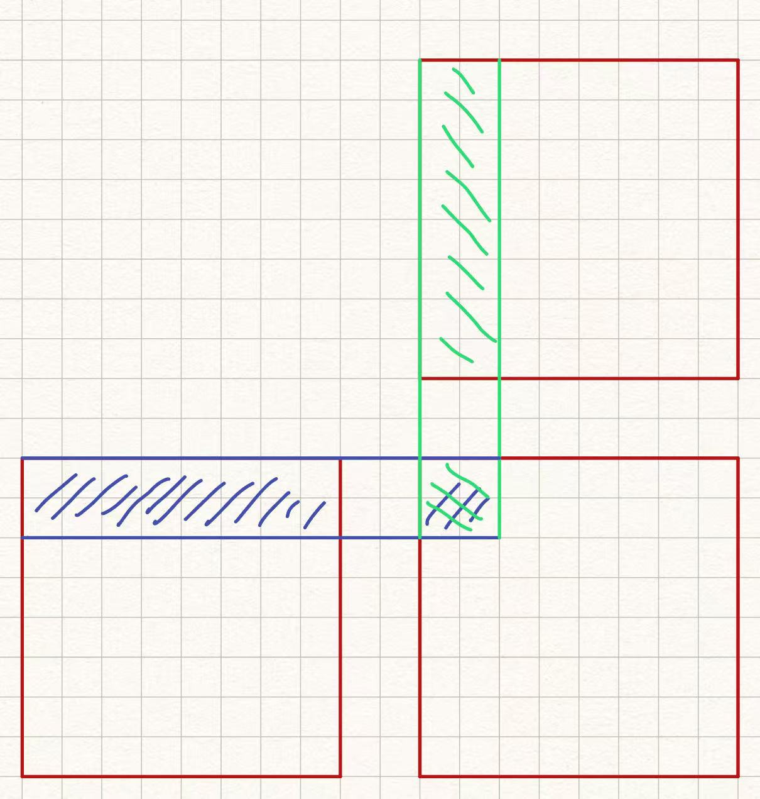
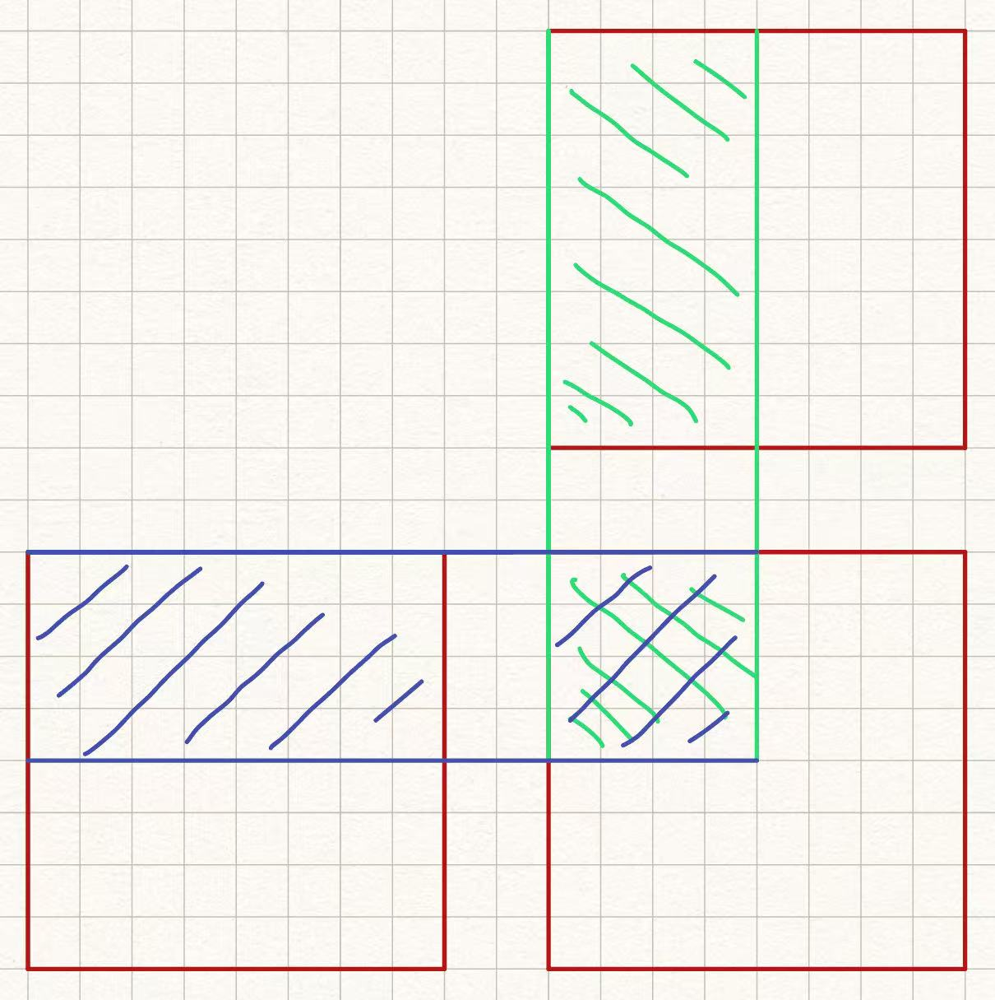

##### Chapter 3

1. - a.
   ```C
    int blockSize = 128; 
    int gridSize  = (R + blockSize - 1) / blockSize;
    oneMatrixRowkernel<<<gridSize, blockSize>>>(M, N, K, R, W, C);

    __global__ void oneMatrixRowkernel(float *M, float *N, float* K, int R, int W, int C){
        int r = blockIdx.x * blockDim.x + threadIdx.x;
        if (r < R) {
            for(int c = 0; c<C; c++){
                float result = 0.0f;
                for(int i = 0; i<W; i++){
                    result += M[r*W + i] * N[i*C + c];
                }
                K[r*C + c] = result;
            }
        }
    }
   ```
   - b. 
   ```C
    int blockSize = 128; 
    int gridSize  = (C + blockSize - 1) / blockSize;
    oneMatrixColkernel<<<gridSize, blockSize>>>(M, N, K, R, W, C);

    __global__ void oneMatrixColkernel(float *M, float *N, float* K, int R, int W, int C){
        int c = blockIdx.y * blockDim.y + threadIdx.y;
        if (c < C) {
            for(int r = 0; r<R; r++){
                float result = 0.0f;
                for(int i = 0; i<W; i++){
                    result += M[r*W + i] * N[i*C + c];
                }
                K[r*C + c] = result;
            }
            
        }
    }
   ```
   - c. if R is large, the row version would have good performance over col version since each thread is calculating one row at a time. If C is large, the col version would have better performance. 
2. 
    ```C
    int blockSize = 128;
    int gridSize = (D+blockSize-1)/blockSize;
    ABC<<<gridSize, blockSize>>>(A, B, C, D);

    __global__ void ABC(float* A, float* B, float* C, int D){
        int i = blockIdx.x*blockDim.x + threadIdx.x;
        if(i < D){
            float result = 0.0f;
            for(int j = 0; j<D; j++){
                result+=B[i*D+j]*C[j];
            }
            A[i] = result;
        }
    }
    ```
3. - a. the number of threads per block = 16*32*1 = 512
   - b. the number of threads in the grid = 512*(((300-1)/16+1)*((150-1)/32+1)*1) = 48640
   - c. the number of blocks in the grid = (((300-1)/16+1)*((150-1)/32+1)*1) = 95
   - d. the number of thread that excute line 05 = 150 * 300 = 45000 
4. - a. row major index = 20*400+10 = 8010
   - b. col major index = 10*500+20 = 5020
5. index = 5*500*400+20*400+10 = 1008010

##### Chapter 4

1. - a. 128/32 = 4 wraps per block
   - b. (1024+128-1)/128*4 = 32 wraps per grid
   - c. 
     - i.  3 wraps (0, 1, 3) are active
     - ii. 1 wraps (1, 3) are divergent
     - iii. SMID effciency of wrap 0 of block 0 is 32/32 = 100%
     - iv. SMID effciency of wrap 1 of block 0 is 8/32 = 25%
     - v. SMID effciency of wrap 3 of block 0 is 24/32 = 75%
   - d. 
     - i. 32 wraps in grid are active
     - ii. 32 wraps in grid are divergence
     - SMID effciency of wrap 0 of block 0 is 50%
   - e. 
     - i. 3 iterasions have no divergence (0 1 2)
     - ii. no iteration have divergence (3 4)
2. block number = (2000+512-1)/512 = 4
   threads number in grid = 4 * 512 = 2048
3. 1 wrap have divergence
4. total execution time = 8 * 3.0 = 24.0
   total running time = 2.0+2.3+3.0+2.8+2.4+1.9+2.6+2.9 = 19.9
   percentage = (24.0-19.9)/24.0 = 17.1%
5. No. Becauce it may cause memory visibility problem. 
6. c. 512 threads per block. In this config there would takes 3 thread blocks with each block 512 threas, 1536 threads in total. 
7. - a. 8*128/2048 = 50%
   - b. 16*64/2048 = 50%
   - c. 32*32/2048 = 50%
   - d. 64*32/2048 = 100%
   - e. 32*64/2048 = 100%
8. - a. (min(32, 2048/128, 65536/128/30)*128)/2048 = 1.0, full occupancy
   - b. (min(32, 2048/32, 65536/32/29)*32)/2048 = 0.5, not full
   - c. (min(32, 2048/256, 65536/256/34)*256)/2048 = 0.875, not full
9. He have some mistake in his description. Threads on block = 32*32 = 1024>512, it wont fit on device 

##### Chapter 5

1. Yes. Reuse variables in shared memory could reduce global memory bandwidth consumption.
2. 
   
   global memory bandwidth after tiling = global memory bandwidth / tile width
3. There are two `__syncthreads()` called in fig 5.9 (line 21 & line 26)
   line 21: RAW problem: data may not updated in all threads
   line 26: WAR problem: reading process may read the modified value since they are using same variable name
4. Shared memory could be seen all threads in block, and it has larger size than register. 
5. The reduction ratio is 1/32
6. The number of versions of variable = 1000*512 = 512000
7. There would be 1000 versions of variables.
8. - a. N times per element
   - b. N/T times per element
9. 36/(7*4) = 1.29
   - a. 200/100 = 2 > 1.29, memory bound
   - b. 300/250 = 1.2 < 1.29, compute bound
10. - a. only on BLOCK_SIZE = 1
    - b. add `__syncthread` between line 10 and 11
11. - a. 8*128 = 1024
    - b. 1024
    - c. 8
    - d. 8
    - e. 4*(1+128) = 516 bytes
    - f. (5+5)/(6*4) = 0.417 OP/B
