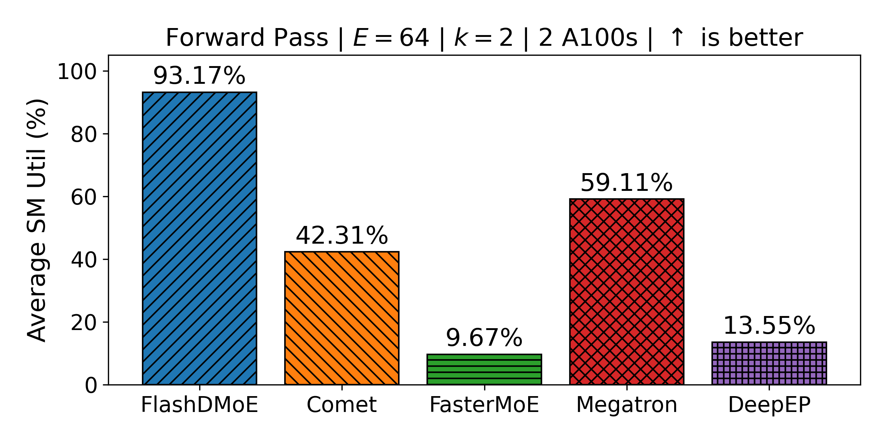
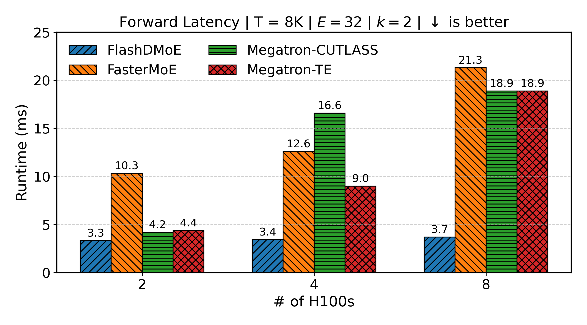
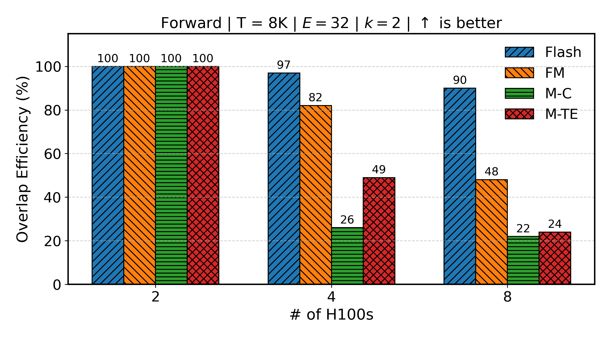
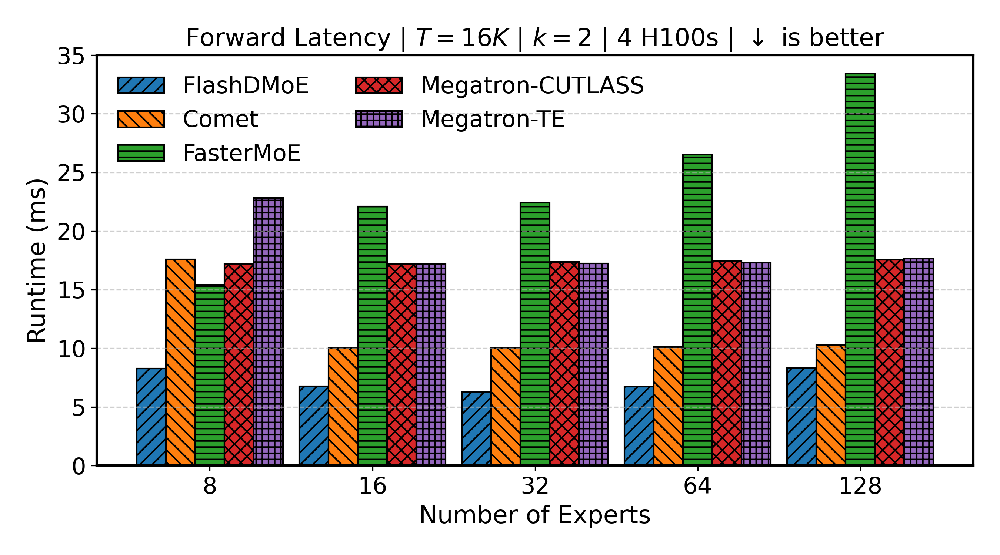
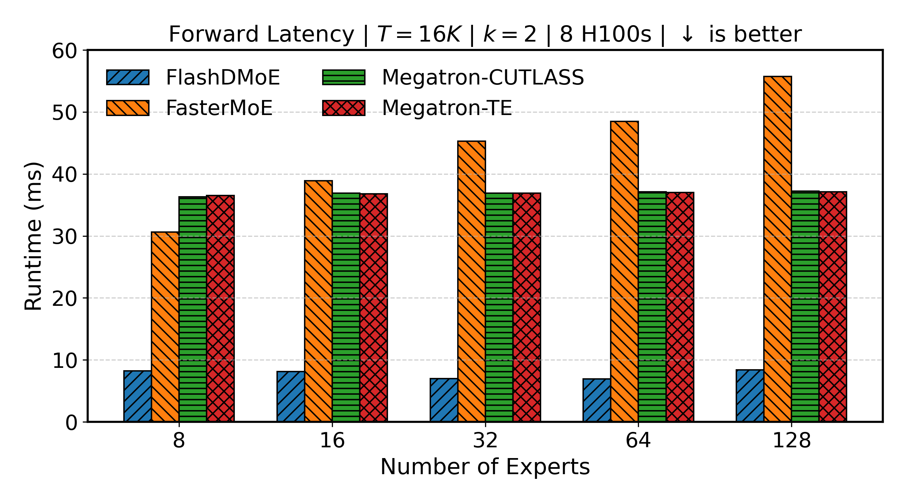
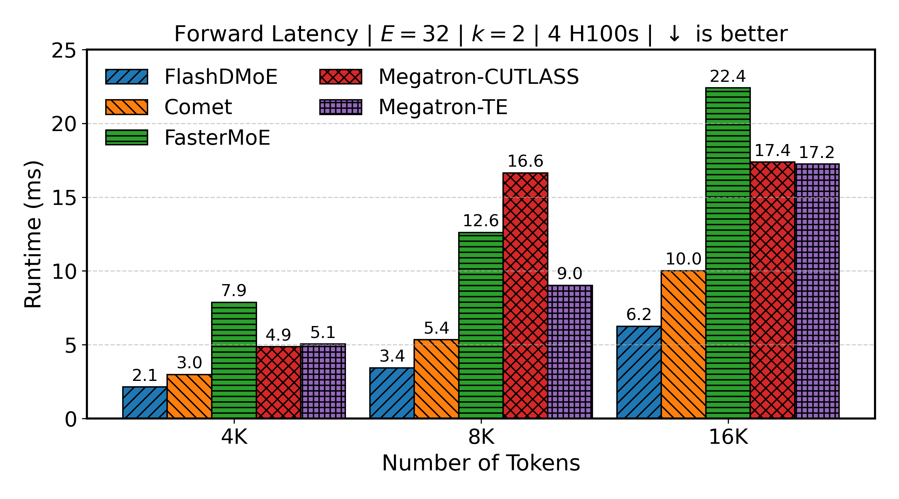
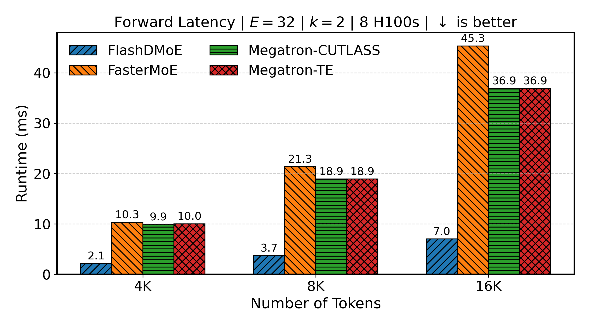

# FlashDMoE: Fast Distributed MoE in a Single Kernel

⚡ A high-performance GPU kernel for MoE workloads  
🚧 Under active research

---

## 🗞️ News

- **Sept 18, 2025** — **FlashDMoE** will appear at NeurIPS'25 (main track)! 
- **June 5, 2025** — ⚡️Introducing **FlashDMoE**, a fused GPU kernel for distributed MoE execution.  

---

## 🧠 Overview

**FlashMoE**, Flash for short, is a high-throughput, portable GPU kernel that fuses the following **Distributed Mixture-of-Experts (DMoE)** operations:
- Gate
- MoE Dispatch
- Expert FFN (GEMM),
- MoE Combine

...into a *single, tile-pipelined, persistent kernel*.

It is written entirely in **pure CUDA**, with no host-device roundtrips, and is part of the **Kleos** runtime.

### 🏎️ Portability

Out-of-the box, Flash supports 
- $\geq$ SM70 GPUs
- RDMA (EFA, libfabric, ibverbs, Slingshot) and NVLink.
- TF32 (peak performance) 
- FP16/BF16 (functionality is complete *but* achieving peak performance is still a work in progress)

---

## 🚨 Problem: Why This Kernel?

Conventional CPU-driven Distributed MoE execution suffers from:
- Kernel launch overhead,
- Network latency due to bulk-synchronous `AllToAll`,
- Straggler effects
- Payload inefficiency (padding) due to rigid communication or compute interfaces,
- Lack of task locality

FlashDMoE addresses this by:
- Performing dispatch, expert compute, and combine **entirely on the GPU**,
- Pipelining across fine-grained tiles,
- Overlapping communication and computation within a fused kernel.

---

## 📊 Performance Results
We compare against [COMET](https://github.com/bytedance/flux) (MLSys '25), [FasterMoE](https://github.com/laekov/fastmoe) (PPoPP '22), [Megatron-CUTLASS, and Megatron-TE](https://github.com/NVIDIA/Megatron-LM/tree/f32b2731acddfb9fe9a91198b27d947286d9d629/megatron/core/transformer/moe).
<div align="center">
  
  <p><em>GPU SM Utilization</em></p>
</div>

| Weak Scaling | Overlap Efficiency |
|:------:|:------:|
|  |  |

| Expert Scalability on 4 H100s | Expert Scalability on 8 H100s |
|:------:|:------:|
|  |  |
| **Token Scaling on 4 H100s** | **Token Scaling on 8 H100s** |
|  |  |

Compared to SOTA baselines, Flash: 
1. increases GPU utilization by up to **9x**, 
2. reduces E2E layer latency by up to **6x**, 
3. attains **4x** better weak scaling efficiency

---

# Run
## Requirements
- Install CPM as [so](https://github.com/cpm-cmake/CPM.cmake?tab=readme-ov-file#adding-cpm). Make sure to create the `cmake` directory as they recommend.
- Install CMake.
- (Optional but recommended) Install ninja

### Building NVSHMEM
For peak performance, (see [here](https://www.nvidia.com/en-us/on-demand/session/gtc24-s61339/)) we *highly* recommend building NVSHMEM from scratch and setting `-DNVSHMEM_ENABLE_ALL_DEVICE_INLINING=1`. The prepackaged deb binary available [here](https://docs.nvidia.com/nvshmem/release-notes-install-guide/install-guide/nvshmem-install-proc.html) does not have that variable set.
- For multi-node: install these software dependencies [here](https://docs.nvidia.com/nvshmem/release-notes-install-guide/install-guide/abstract.html#software-requirements)
- Go to the NVSHMEM Download page and get the `Open Source Packages`.
- Decompress the file appropriately
- `cd nvshmem && mkdir build && cd build`
- `export NVHSMEM_PREFIX=<to the installation directory>`
- For multi-node: Set other appropriate transport environment variables from [here](https://docs.nvidia.com/nvshmem/release-notes-install-guide/install-guide/nvshmem-install-proc.html#other-distributions)
- To fix a build bug: `export CUDAFLAGS='-fpermissive' CXXFLAGS='-fpermissive'`
- Run `cmake -S.. -B. -DNVSHMEM_ENABLE_ALL_DEVICE_INLINING=1 -Wno-dev`
- Run `make -j install`

## CMake Build
1. cd `csrc`
2. mkdir `cmake-build-release` && cd `cmake-build-release`
3. Configure `kleos_config.json` as needed.
4. Run `cmake -DCMAKE_BUILD_TYPE=Release -DCMAKE_MAKE_PROGRAM=<path to ninja> -Wno-dev -G Ninja -S .. -B .`
5. Run `cmake --build . --target csrc -j`
> 💡 Note you must rebuild the application (4 and 5) to propagate any subsequent changes made to `kleos_config.json`. This intermediate stage is a compilation and performance optimization, as it exposes those parameters in the json file as _static_ constants within the application. Doing so reduces build times by about 60x (1 hour → ~1 min) as it allows for sidestepping exhaustive template instantiations, given the template parameters are known a priori. On the other hand, static constants allows for (1) loop unrolling, which we heavily adopt, (2) optimized mathematical operations, modular arithmetic for example, (3) code path elimination via `if constexpr` and (4) compile-time computations for address calculations which present recurrently in tensor indexing. We leverage all of these and some more additional compile-time optimizations in Flash.
## Single Node
- Run `nvshmrun -n <number of processes> -ppn <processes per node> ./csrc`
## Multi node
### SLURM
```
srun -n <number of processes> ./csrc
```

## IDEs
Alternatively, the codebase integrates well with CLion, which automates the build and run processes. 
Just open the project at `csrc` and CLion will automatically detect the `CMakeLists.txt` file.

---

# 📖 Citation
If you use any part of FlashDMoE in your research, please cite:
```
@misc{aimuyo2025flashdmoe,
      title={FlashDMoE: Fast Distributed MoE in a Single Kernel}, 
      author={Osayamen Jonathan Aimuyo and Byungsoo Oh and Rachee Singh},
      year={2025},
      eprint={2506.04667},
      archivePrefix={arXiv},
      primaryClass={cs.DC},
      url={https://arxiv.org/abs/2506.04667}, 
}
```


## ⚖️ License

This project is licensed under the BSD 3-Clause License. See [`LICENSE`](./LICENSE) for full terms.
